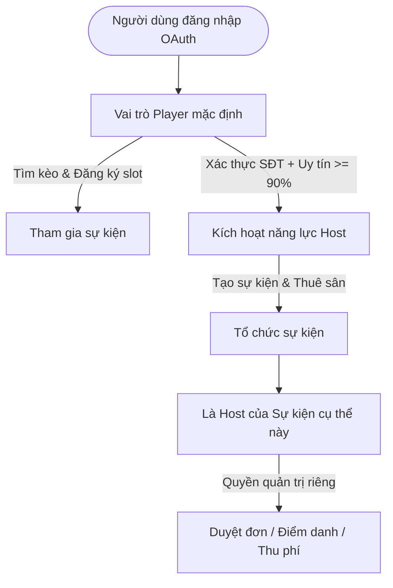

# HƯỚNG DẪN PHÂN QUYỀN TÀI KHOẢN THEO ROLE HOST VÀ PLAYER (RALLYMAX)

Tài liệu này cung cấp hướng dẫn toàn diện về kiến trúc phân quyền (**Role-Based Access Control - RBAC**), thiết kế chính sách bảo mật cơ sở dữ liệu (**Supabase Row Level Security - RLS**) và cách lập trình kiểm soát quyền hạn trên giao diện Frontend (**React/TypeScript**) cho nền tảng kết nối cầu lông **RallyMax**.

---

## 1. Bản Chất Phân Quyền Trong Nền Tảng Cầu Lông

Trong thể thao phong trào, vai trò giữa **Host (Người tổ chức/Chủ xị)** và **Player (Người tham gia)** có đặc thù rất riêng:
* **Mô hình Contextual Role (Theo ngữ cảnh sự kiện)**: Một người sáng nay có thể là **Host** (tổ chức trận cầu 4 sân tại Viettel), nhưng tối mai lại là **Player** (đăng ký tham gia buổi giao lưu do người khác tổ chức).
* **Mô hình Hybrid Verification (Khuyên dùng)**: Mọi tài khoản sau khi xác thực OAuth (Google/Facebook) đều mặc định có vai trò **Player**. Để tổ chức sự kiện (Host), hệ thống yêu cầu hồ sơ đạt chuẩn (có số điện thoại, điểm uy tín $\ge 90\%$, hoặc cờ `is_verified_host`).



---

## 2. Ma Trận Phân Quyền Chi Tiết (Permission Matrix)

Bảng phân định chi tiết quyền hạn giữa **Host** và **Player** trên từng thực thể nghiệp vụ:

| Thực thể / Tính năng | Player (Người chơi) | Host (Chủ xị của Event) | Người ngoài / Khách |
| :--- | :--- | :--- | :--- |
| **Hồ sơ cá nhân (Profiles)** | Xem tất cả, chỉ sửa hồ sơ của mình | Xem tất cả, chỉ sửa hồ sơ của mình | Chỉ xem thông tin công khai |
| **Khám phá kèo (Events)** | Xem tất cả các kèo đang mở (`OPEN`, `FULL`) | Xem tất cả các kèo | Xem danh sách công khai |
| **Tạo kèo mới (Create Event)** | Không (Cần bật chế độ Host) | **Có toàn quyền** | Không |
| **Sửa / Hủy kèo đã tạo** | Không | **Chỉ Host tạo kèo đó mới được sửa** | Không |
| **Đăng ký tham gia (Register)** | **Đăng ký slot, xin vào hàng chờ** | Không tự đăng ký slot của chính mình | Phải đăng nhập trước |
| **Rút lui khỏi kèo (Cancel Reg)** | **Có** (kèm lý do trước giờ G) | Không áp dụng | Không |
| **Duyệt / Từ chối đơn đăng ký** | Không | **Có** (`APPROVED`, `REJECTED`) | Không |
| **Điểm danh ("Có mặt" / "Báo bùng")** | Không | **Có** (`CHECKED_IN`, `NO_SHOW`) | Không |
| **Xác nhận thanh toán (Tiền sân)** | Đánh dấu "Đã chuyển khoản" | **Xác nhận "Đã thu" / "Chưa thu"** | Không |
| **Đánh giá sau trận (Reviews)** | Đánh giá Host & Bạn chơi cùng | Đánh giá Player tham gia | Không |
| **Thêm địa điểm sân (Venues)** | Chỉ gửi yêu cầu thêm sân mới | **Tạo và quản lý danh mục sân** | Không |

---

## 3. Triển Khai Phân Quyền Trên Database (Supabase RLS)

Cơ chế phân quyền quan trọng nhất phải nằm ở tầng **Database** thông qua **Row Level Security (RLS)** của PostgreSQL. Ngay cả khi ai đó cố tình gọi API trực tiếp, RLS sẽ ngăn chặn các hành vi trái phép.

### Bước 3.1: Mở rộng bảng `profiles` với cờ Host & Vai trò
Mở **Supabase Dashboard > SQL Editor**, chạy script sau để thêm các trường hỗ trợ phân quyền:

```sql
-- 1. Bổ sung các cột phân quyền vào bảng profiles
ALTER TABLE public.profiles 
ADD COLUMN IF NOT EXISTS role VARCHAR(20) DEFAULT 'PLAYER' CHECK (role IN ('PLAYER', 'HOST', 'ADMIN')),
ADD COLUMN IF NOT EXISTS is_verified_host BOOLEAN DEFAULT FALSE;

-- 2. Chỉ số uy tín tối thiểu để được cấp quyền Host (mặc định 90%)
COMMENT ON COLUMN public.profiles.is_verified_host IS 'Được ban quản trị hoặc hệ thống cấp chứng nhận Host uy tín';
```

---

### Bước 3.2: Bật RLS và Thiết lập Policies cho bảng `profiles`

```sql
-- Kích hoạt RLS
ALTER TABLE public.profiles ENABLE ROW LEVEL SECURITY;

-- 1. Mọi người (kể cả khách) đều có thể xem danh sách profile công khai
DROP POLICY IF EXISTS "Public profiles are viewable by everyone" ON public.profiles;
CREATE POLICY "Public profiles are viewable by everyone" 
ON public.profiles FOR SELECT 
USING (true);

-- 2. Chỉ người sở hữu tài khoản mới được sửa profile của chính mình
DROP POLICY IF EXISTS "Users can update their own profile" ON public.profiles;
CREATE POLICY "Users can update their own profile" 
ON public.profiles FOR UPDATE 
USING (auth.uid() = id)
WITH CHECK (auth.uid() = id);
```

---

### Bước 3.3: Chính sách RLS cho bảng `events` (Sự kiện cầu lông)

```sql
ALTER TABLE public.events ENABLE ROW LEVEL SECURITY;

-- 1. Bất kỳ ai cũng có thể xem danh sách sự kiện công khai
DROP POLICY IF EXISTS "Events are viewable by everyone" ON public.events;
CREATE POLICY "Events are viewable by everyone" 
ON public.events FOR SELECT 
USING (status != 'DRAFT' OR host_id = auth.uid());

-- 2. Chỉ người dùng đã đăng nhập và đủ điều kiện Host mới được tạo sự kiện
DROP POLICY IF EXISTS "Hosts can create events" ON public.events;
CREATE POLICY "Hosts can create events" 
ON public.events FOR INSERT 
WITH CHECK (
    auth.role() = 'authenticated' AND 
    auth.uid() = host_id
);

-- 3. CHỈ DUY NHẤT Host tạo ra sự kiện mới được sửa hoặc hủy sự kiện đó
DROP POLICY IF EXISTS "Host can update their own event" ON public.events;
CREATE POLICY "Host can update their own event" 
ON public.events FOR UPDATE 
USING (auth.uid() = host_id)
WITH CHECK (auth.uid() = host_id);

-- 4. CHỈ DUY NHẤT Host tạo ra sự kiện mới được xóa sự kiện
DROP POLICY IF EXISTS "Host can delete their own event" ON public.events;
CREATE POLICY "Host can delete their own event" 
ON public.events FOR DELETE 
USING (auth.uid() = host_id);
```

---

### Bước 3.4: Chính sách RLS cho bảng `event_registrations` (Đăng ký tham gia)

Đây là bảng quan trọng nhất đòi hỏi phân quyền 2 chiều:
* **Player** chỉ được tạo đăng ký cho chính mình (`player_id = auth.uid()`) và chỉ được sửa trạng thái của mình thành `CANCELLED`.
* **Host của sự kiện** có quyền cập nhật trạng thái duyệt đơn, điểm danh và thanh toán của tất cả người đăng ký trong sự kiện của họ.

```sql
ALTER TABLE public.event_registrations ENABLE ROW LEVEL SECURITY;

-- 1. Người chơi xem được đơn của mình; Host xem được tất cả đơn trong sự kiện của họ
DROP POLICY IF EXISTS "View registrations policy" ON public.event_registrations;
CREATE POLICY "View registrations policy" 
ON public.event_registrations FOR SELECT 
USING (
    player_id = auth.uid() OR 
    EXISTS (
        SELECT 1 FROM public.events e 
        WHERE e.id = event_registrations.event_id AND e.host_id = auth.uid()
    )
);

-- 2. Player đăng ký tham gia sự kiện (Chỉ được đăng ký cho chính mình)
DROP POLICY IF EXISTS "Player can register for event" ON public.event_registrations;
CREATE POLICY "Player can register for event" 
ON public.event_registrations FOR INSERT 
WITH CHECK (
    auth.role() = 'authenticated' AND 
    player_id = auth.uid() AND
    -- Không cho phép Host tự đăng ký vào sự kiện của chính mình
    NOT EXISTS (
        SELECT 1 FROM public.events e 
        WHERE e.id = event_id AND e.host_id = auth.uid()
    )
);

-- 3. Phân quyền Cập nhật (UPDATE) đơn đăng ký:
-- A. Player chỉ được tự hủy đơn (status = 'CANCELLED')
-- B. Host có toàn quyền duyệt (APPROVED/REJECTED), điểm danh (CHECKED_IN/NO_SHOW), thu phí (PAID)
DROP POLICY IF EXISTS "Update registrations policy" ON public.event_registrations;
CREATE POLICY "Update registrations policy" 
ON public.event_registrations FOR UPDATE 
USING (
    -- Là chính người chơi đó
    player_id = auth.uid() OR
    -- Hoặc là Host của sự kiện
    EXISTS (
        SELECT 1 FROM public.events e 
        WHERE e.id = event_registrations.event_id AND e.host_id = auth.uid()
    )
)
WITH CHECK (
    player_id = auth.uid() OR
    EXISTS (
        SELECT 1 FROM public.events e 
        WHERE e.id = event_registrations.event_id AND e.host_id = auth.uid()
    )
);
```

---

### Bước 3.5: Chính sách RLS cho bảng `reviews` (Đánh giá uy tín)

```sql
ALTER TABLE public.reviews ENABLE ROW LEVEL SECURITY;

-- 1. Ai cũng xem được đánh giá công khai
CREATE POLICY "Reviews are viewable by everyone" 
ON public.reviews FOR SELECT 
USING (true);

-- 2. Chỉ người đã tham gia trận đấu (đã CHECKED_IN) mới được gửi đánh giá
CREATE POLICY "Participants can create reviews" 
ON public.reviews FOR INSERT 
WITH CHECK (
    auth.role() = 'authenticated' AND 
    reviewer_id = auth.uid() AND
    -- Phải có mặt trong sự kiện đó
    EXISTS (
        SELECT 1 FROM public.event_registrations reg
        WHERE reg.event_id = reviews.event_id 
          AND reg.player_id = auth.uid() 
          AND reg.status = 'CHECKED_IN'
    )
);
```

---

## 4. Triển Khai Phân Quyền Trên Frontend (React & TypeScript)

Trên giao diện người dùng, phân quyền giúp ẩn/hiện các chức năng phù hợp để người dùng không thao tác nhầm lẫn.

### 4.1 Quản lý trạng thái Role trong `AppContext.tsx`

Hệ thống lưu trữ vai trò hoạt động hiện tại (`activeRole`) và cung cấp các hàm kiểm tra năng lực:

```tsx
// src/context/AppContext.tsx
interface AppContextType {
  currentUser: Profile | null;
  activeRole: 'player' | 'host';
  setActiveRole: (role: 'player' | 'host') => void;
  
  // Helpers kiểm tra quyền hạn (Role Guards)
  isHostOfEvent: (event: Event) => boolean;
  canCreateEvent: () => boolean;
  isRegisteredForEvent: (event: Event) => boolean;
}
```

Cài đặt logic kiểm tra quyền:

```tsx
// 1. Kiểm tra xem người dùng hiện tại có phải là Host của sự kiện cụ thể này không
const isHostOfEvent = (event: Event): boolean => {
  if (!currentUser) return false;
  return event.host_id === currentUser.id;
};

// 2. Kiểm tra điều kiện tài khoản có đủ tiêu chuẩn tổ chức kèo (Host)
const canCreateEvent = (): boolean => {
  if (!currentUser) return false;
  // Điều kiện: Điểm uy tín >= 80% và đã cập nhật số điện thoại
  const hasPhone = Boolean(currentUser.phone_number && currentUser.phone_number.length >= 9);
  const isGoodReliability = (currentUser.reliability_score ?? 100) >= 80;
  return hasPhone && isGoodReliability;
};
```

---

### 4.2 Guard giao diện trên thanh Điều hướng (`Navigation.tsx`)

Thanh Top Navigation cung cấp nút chuyển vai trò linh hoạt:

```tsx
{/* Chỉ hiển thị khi đã đăng nhập */}
{isLoggedIn && (
  <Button
    variant="secondary"
    size="sm"
    label={activeRole === 'host' ? '👑 Đang là Host' : '🏸 Đang là Player'}
    onClick={() => setActiveRole(activeRole === 'host' ? 'player' : 'host')}
  />
)}

{/* Nút tạo kèo: Nếu đang là Player bấm vào sẽ tự chuyển sang luồng Host */}
<Button
  variant="primary"
  size="sm"
  label="Tạo kèo mới"
  onClick={() => {
    if (!canCreateEvent()) {
      alert('Bạn cần cập nhật số điện thoại trong Hồ sơ để mở quyền tổ chức kèo!');
      return;
    }
    setActiveRole('host');
    onOpenCreateEvent();
  }}
/>
```

---

### 4.3 Guard quyền trong Modal Chi tiết kèo (`EventDetailModal.tsx`)

Trong màn hình sự kiện, giao diện tự động phân định:

```tsx
const isHost = currentUser?.id === event.host_id;
const myRegistration = event.registrations?.find(r => r.player_id === currentUser?.id);

return (
  <VStack gap={4}>
    {/* NẾU LÀ HOST: Hiển thị thanh công cụ quản lý của Chủ xị */}
    {isHost ? (
      <HStack gap={2}>
        <Button variant="secondary" label="✏️ Sửa thông tin kèo" onClick={handleEditEvent} />
        <Button variant="destructive" label="🚫 Hủy sự kiện" onClick={handleCancelEvent} />
      </HStack>
    ) : (
      /* NẾU LÀ PLAYER: Hiển thị nút Đăng ký hoặc Rút lui */
      <HStack gap={2}>
        {!myRegistration ? (
          <Button variant="primary" label="🏸 Xác nhận tham gia" onClick={handleRegister} />
        ) : (
          <Button variant="destructive" label="Xin rút lui khỏi slot" onClick={handleCancelMySlot} />
        )}
      </HStack>
    )}

    {/* BẢNG NGƯỜI CHƠI: Cột thao tác duyệt đơn chỉ Host mới nhìn thấy nút bấm */}
    <Table>
      {/* ... */}
      <TableRow>
        <TableCell>{player.full_name}</TableCell>
        <TableCell>{player.status}</TableCell>
        <TableCell>
          {isHost ? (
            <HStack gap={1}>
              <Button size="xs" variant="primary" label="Duyệt" onClick={() => approvePlayer(reg.id)} />
              <Button size="xs" variant="secondary" label="Có mặt" onClick={() => checkInPlayer(reg.id)} />
              <Button size="xs" variant="destructive" label="Báo bùng" onClick={() => markNoShow(reg.id)} />
            </HStack>
          ) : (
            <Text type="supporting">Chỉ Host quản lý</Text>
          )}
        </TableCell>
      </TableRow>
    </Table>
  </VStack>
);
```

---

## 5. Quy Trình Kiểm Thử Phân Quyền (Verification Steps)

### Kịch bản 1: Kiểm thử bảo vệ quyền sở hữu sự kiện (Host Ownership)
1. Dùng **Tài khoản A (Host Hoàng Nam)** tạo một sự kiện đánh cầu vào Thứ Bảy.
2. Đăng xuất, đăng nhập bằng **Tài khoản B (Player Minh Tuấn)**.
3. Mở chi tiết sự kiện của Hoàng Nam:
   - **Kỳ vọng trên UI**: Nút "Sửa thông tin", "Hủy sự kiện", các nút duyệt người chơi, nút điểm danh không được hiển thị. Chỉ hiển thị nút **"Xác nhận tham gia"**.
   - **Kỳ vọng dưới DB (RLS)**: Nếu Tài khoản B cố ý gửi lệnh `UPDATE events SET title = 'Hacked'` bằng API key, PostgreSQL sẽ chặn với lỗi `403 Forbidden` hoặc `0 rows affected`.

### Kịch bản 2: Kiểm thử chống tự đăng ký vào sự kiện của chính mình
1. Đăng nhập với tư cách **Host Hoàng Nam**.
2. Mở sự kiện do chính Nam tạo:
   - Nút "Xác nhận tham gia" sẽ tự động ẩn (vì Host đã là người giữ sân).

### Kịch bản 3: Điểm danh & Xử phạt bùng kèo (Anti-Ghosting)
1. Host duyệt Player vào sự kiện (`APPROVED`).
2. Vào giờ thi đấu, nếu Player không đến, Host bấm **"Báo bùng" (`NO_SHOW`)**.
3. Hệ thống kích hoạt trigger tự động trừ $5\%$ điểm uy tín (`reliability_score`) của Player đó. Khi điểm uy tín $< 70\%$, Player sẽ bị hạn chế quyền đăng ký các kèo tự động duyệt.

---

## 6. Tổng Kết Danh Sách File Cần Chú Ý Trong Dự Án

* 📁 [SUPABASE_SETUP_GUIDE.md](file:///Users/cellphones/Desktop/uxcamp_thieu_nu/SUPABASE_SETUP_GUIDE.md): Chứa DDL tạo bảng ban đầu.
* 📁 [ROLE_BASED_ACCESS_CONTROL_GUIDE.md](file:///Users/cellphones/Desktop/uxcamp_thieu_nu/ROLE_BASED_ACCESS_CONTROL_GUIDE.md): Tài liệu hướng dẫn phân quyền RBAC & các RLS Policies chi tiết (File hiện tại).
* 📁 [src/types/database.ts](file:///Users/cellphones/Desktop/uxcamp_thieu_nu/src/types/database.ts): Khai báo kiểu TypeScript chuẩn xác (`Profile`, `Event`, `EventRegistration`, `RegistrationStatus`).
* 📁 [src/context/AppContext.tsx](file:///Users/cellphones/Desktop/uxcamp_thieu_nu/src/context/AppContext.tsx): Quản lý phiên đăng nhập và các nghiệp vụ phân quyền cấp ứng dụng.
* 📁 [src/components/Navigation.tsx](file:///Users/cellphones/Desktop/uxcamp_thieu_nu/src/components/Navigation.tsx): Thanh menu với nút chuyển đổi vai trò (`Active Role`).
* 📁 [src/components/EventDetailModal.tsx](file:///Users/cellphones/Desktop/uxcamp_thieu_nu/src/components/EventDetailModal.tsx): Phân tách giao diện quản lý Host và Player trên từng trận đấu.
